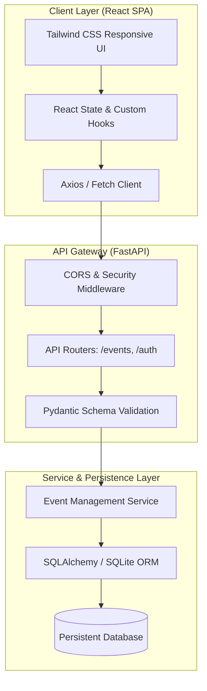

# System Architecture & Technical Specifications

## Overview
`Event-Tracker` is a decoupled full-stack event management system providing real-time event indexing, filtering, search, and admin management.

---

## Architectural Decision Records (ADRs)

### ADR-001: Schema-First Data Validation with Pydantic
* **Status**: Accepted
* **Context**: Event submissions must strictly validate dates, capacities, categories, and payloads before database operations.
* **Decision**: Use Pydantic models for request parsing, input sanitization, and automatic OpenAPI schema generation.
* **Consequences**: Eliminates payload injection risks, prevents schema drift, and generates interactive Swagger documentation.

### ADR-002: Layered Separation of Concerns
* **Status**: Accepted
* **Context**: Direct database queries inside API routes create technical debt and hinder unit testing.
* **Decision**: Strict 3-layer architecture: Router (HTTP handling) -> Service (Business logic) -> Model/Repository (Data access).
* **Consequences**: Fast unit testing with mocked repository layers; simple database engine swaps.
