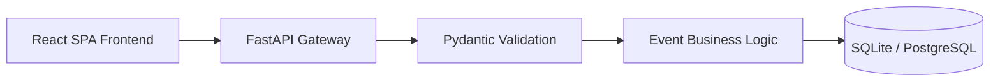

# Event Tracker

Event Tracker (FOCES Events) is a full-stack app for submitting and tracking events. It was originally created for the FOCES Volunteer Project 2025-26, but is now named Event Tracker.

## Quickstart

### Backend (FastAPI)
1. Open a terminal in the `backend` folder
2. Create and activate a virtual environment:
   ```pwsh
   python -m venv venv
   .\venv\Scripts\Activate.ps1
   pip install -r requirements.txt
   ```
3. Start the server:
   ```pwsh
   uvicorn main:app --reload
   ```
   - The API is available at `http://localhost:8000/events`

### Frontend (React + Vite)
1. Open a terminal in the `frontend` folder
2. Install dependencies:
   ```pwsh
   npm install
   ```
3. Start the dev server:
   ```pwsh
   npm start
   ```
   - The app is available at `http://localhost:5173/Event-Tracker/`
4. Run tests:
   ```pwsh
   npm test
   ```

The frontend calls the API base URL `http://localhost:8000/events` directly, and the Vite dev server also proxies `/events` requests to `http://localhost:8000`.

## Tech stack
- **Backend:** FastAPI (Python), Uvicorn, Pydantic, ruff for linting
- **Frontend:** React + Vite, Tailwind CSS, Workbox service worker, Vitest

## Features
- List events (name, description, date, time, organizer)
- Add new events through a form
- Responsive UI with Tailwind
- Search filter
- Modal for event details
- Dark mode toggle
- Loading, error, and empty states

## API

| Method | Endpoint | Description |
| --- | --- | --- |
| GET | `/events` | List all events |
| POST | `/events` | Add an event |

Events are stored in memory, so data resets when the server restarts.

## Project structure
```
Event-Tracker/
├── backend/
│   ├── main.py
│   └── requirements.txt
└── frontend/
    ├── src/
    ├── public/
    ├── package.json
    └── tailwind.config.js
```

## How it works
- The backend exposes `/events` endpoints for GET (list events) and POST (add event).
- The frontend fetches events from the backend and displays them in cards.
- Users can add new events using the form.
- Search, modal, and dark mode features improve usability.
- A Workbox service worker precaches assets in production builds.

## Deployment
You can deploy the backend on platforms like Heroku, Render, or Railway. You can deploy the frontend on Vercel or Netlify.

## Author
- Sebin GG

---

For any issues, open an issue on the GitHub repo.

---

## 📐 System architecture

The app uses a decoupled full-stack architecture with strict separation between API routing, schema validation, and persistence:



Detailed architectural decision records (ADRs) and data flows are documented in [ARCHITECTURE.md](./ARCHITECTURE.md).

## 🔒 Security

This repository uses [gitleaks](https://github.com/gitleaks/gitleaks) for automatic secret scanning on every commit.

### Pre-commit hook

A pre-commit hook scans for secrets before each commit. This helps prevent accidentally committing sensitive information like:
- API keys
- Passwords
- Tokens
- Private keys

### Setup

To enable the pre-commit hook locally:

```bash
# Install pre-commit
pip install pre-commit

# Install hooks
pre-commit install
```

### Bypass (emergency only)

In case of emergency, you can bypass the hook:

```bash
git commit --no-verify -m "emergency commit"
```

> ⚠️ Only use `--no-verify` in emergency situations. Regular commits should always be scanned.
